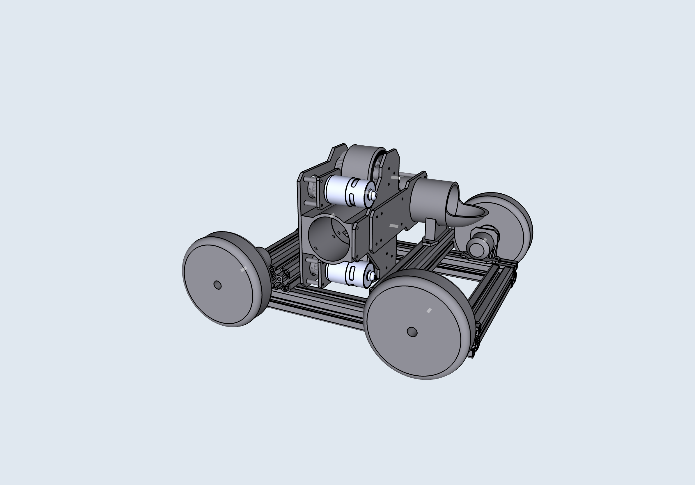

# TennisBot

**Julian Ho, Cass Wang**

**COSI 119A Fall 2020**

TennisBot is a tennis playing robot capable of playing a full tennis match.

*^Early draft of the TennisBot shown*

## Final Report

[Github Pages](https://hojulian.github.io/TennisBot)

## Directory Structure

* `/docs` - final report, github pages
* `/docs/images` - images of the project
* `/firmware` - all firmware/configs for MCU, motor ESCs, and actuator
* `/hardware` - BOM
* `/lib/quickshot` - QuickShot library
* `/models/designs` - 3D design source files
* `/models/gazebo` - 3D models in gazebo
* `/reports` - weekly reports
* `/tools` - snapshot of the tools for ESC configuration
