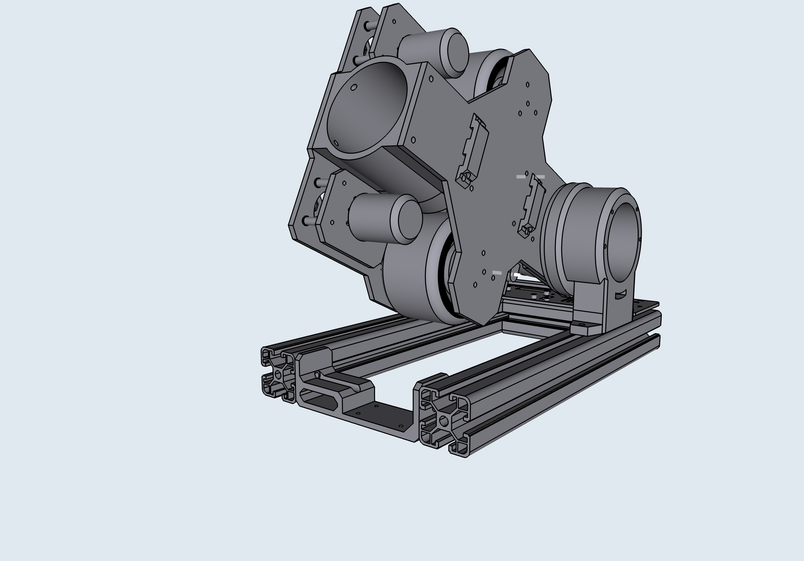
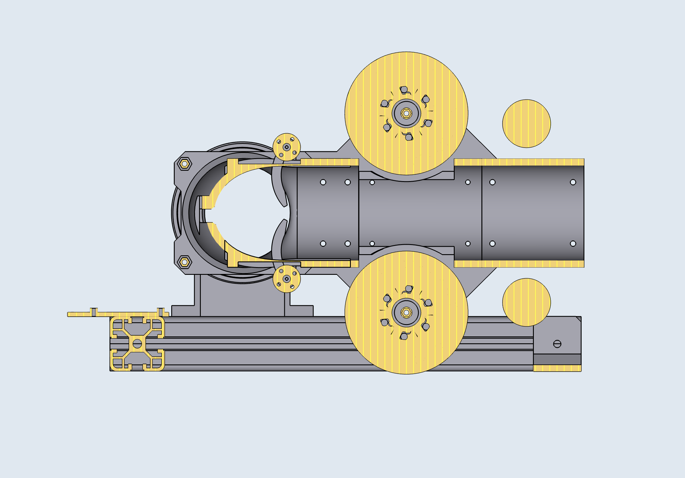

# Design

## Overall

When designing the TennisBot v1, we gave ourselves a couple hard requirements,

1. Capable of shooting a professional shot (~70 mph speed, ~3000 rpm spin)
2. Can shoot a ball to any position of the court, +/- 5cm tolerance
3. Battery powered
4. Portable

With these limitations, we had to constraint and revise our design a lot.

(1) and (2) depends on our motor selection, we needed motors that can reach >10,000 rpm while being relatively lightweight. Therefore we picked a 3548 BLDC motor, which is capable of reaching 19,980 rpm at 22.2v, at 150g a piece. At our maximum requirement of 8500 rpm, this motor will draw ~35A which is acceptable for our use case. In order to accurately land a ball, we need fine control of the shooter's angle. We picked a large 9235 BLDC motor, combined with an AS5047p 14bit absolute magnetic encoder, that gives us a fine grained angle control of 0.02 degrees.

(3) is relatively easy constraint since the modern LiPo batteries can have a high power output while being portable (commonly used in RC cars and drones). We designed the whole robot to be DC powered, and can be charged with a portable power adapter.

(4) created constraint on the physical weight and size of the robot. We designed the robot to have a small footprint (less than the size of a pizza box), and light enough to be carried with a suitcase (~ 10Kg total).

## Changes along the way

During the physical testing of our design, we realized a couple things that needed to be changed.

* Actuator not powerful enough to hold shooter's angle
  * Solution: changed motor from 7032 to a larger 9235
* Belt is too loss/shakey during operation
  * Solution: added 2 idlers, 1 for each motors
* Belt sometimes scratches the carbon fiber plate
  * Solution: changed to narrower belts (12mm -> 10mm width) and also a narrower gear to keep the belt in posistion (Idlers helped with this as well)
* Not enough friction between the 2 wheels and the tennis ball
  * Solution: changed to larger wheels (83mm -> 90mm diameter) to have a larger contact area with the ball, and compress the ball more during shots
* Encoder producing noisy signal
  * Solution: used shielded cables instead to protect the signal from motors' EMI

## 3D Modelling

TennisBot is designed using Shapr3D. All the source design files can be found under [/models/designs](../models/designs).

Here are some images of TennisBot v1 in 3D and AR.

