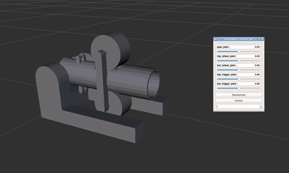

# Simulation

In order to test out the robot, we exported the 3D model into gazebo, along with a custom built testing ground.

All source files are in [/models/gazebo](../models/gazebo).

## TennisBot v1

In order to keep our simulation simple and smooth, we exported a simplified version of the TennisBot using solidworks' URDF exporter. This simplified verion has a simple geometry while maintaining the exact dimensions of the robot.



*^Here it is running in RViz*

This model has a total of 5 joints,

* 1 joint for tilt control
* 1 joint per wheel
* 1 joint per trigger

Each joint can be independently controlled (as shown above).

All the source files can be found in [/models/gazebo/tennisbot_support](../models/gazebo/tennisbot_support).

### Launch in RViz

```bash
roslaunch tennisbot_support display.launch
```

### Launch in Gazebo

```bash
roslaunch tennisbot_support gazebo.launch
```
