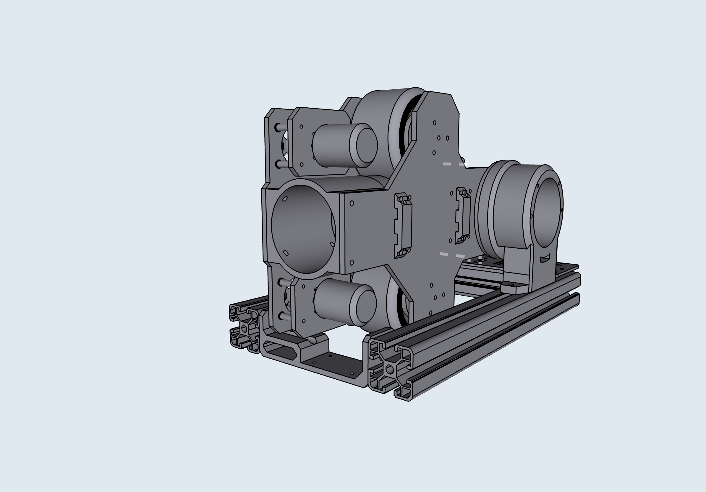

# TennisBot v1

TennisBot v1 is a tennis playing robot that can serve balls at a fixed location. It has tilt, top/back spin, as well as ball frequency control. It is capable of shooting the ball at 40 m/s^ (or 89.5 mph) and spin of 8490 rpm^.

*^Theoretical highest speed, based on the selected motor and power output*

## Features

* 40 m/s top ball speed
* 8490 max ball RPM
* battery powered

* 2 BLDC motors powered by 2 lightweight ESCs
* 1670W of raw motor power
* 2:1 gear ratio
* 90mm wheels

* RPi 4 running ROS melodic
* ESP32 for hardware control
* Communicate using over serial via USB using rosserial

## Design

See [Design](design.md).

## V1 Limitations

This version of TennisBot is not capable of playing a full tennis match just yet, since it only includes the shooter component. However, the shooter component allows us to practice returns, and some tennis drills.
