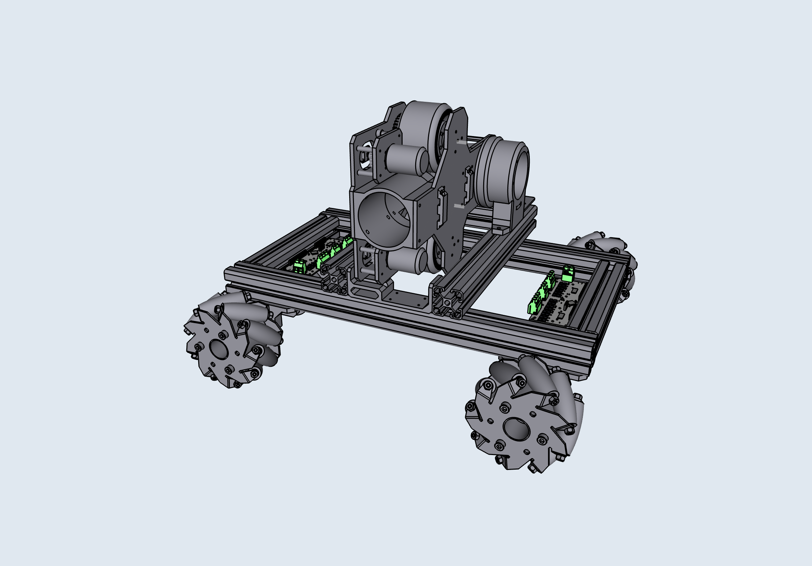

# V2 and Beyond



The eventual goal for this project is to have a fully automated robot for playing a full tennis match.

## V2 Changes

* A chassis will be added, driven by 4 omni-directional wheels each with an individual motor.
* QuickShot library will support target in `x` direction as well.

    ```python
    # Shoot the ball 1 meter to the left and 2 meters up front.
    q.calc_params(
      y=200,
      x=-100,
      # ...
    )
    ```

* A stereo depth camera on-board for trajectory prediction, in order for the robot to "return" the ball.
* The v2 robot does not actually return the ball in the traditional sense, instead, it moves to where the ball is suppose to land and shoots a ball back immediately.
